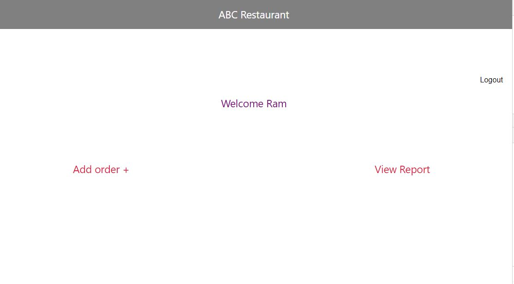
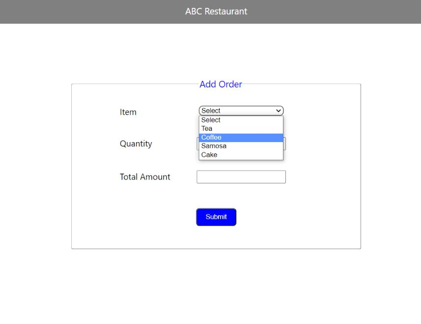
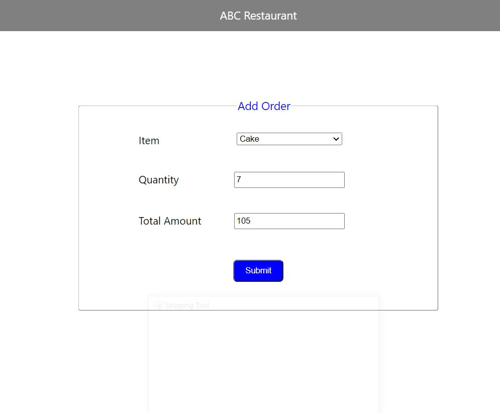
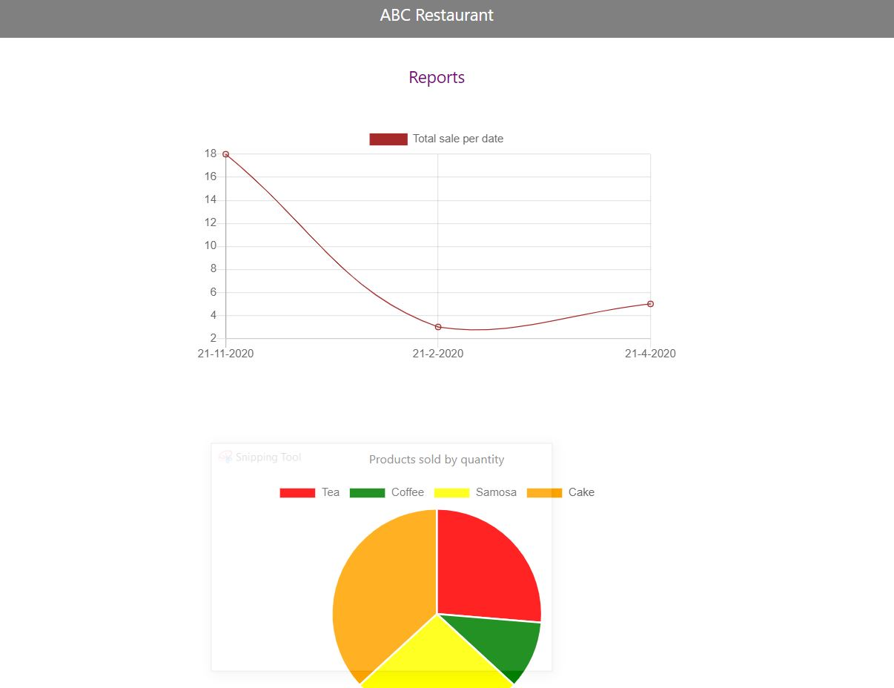
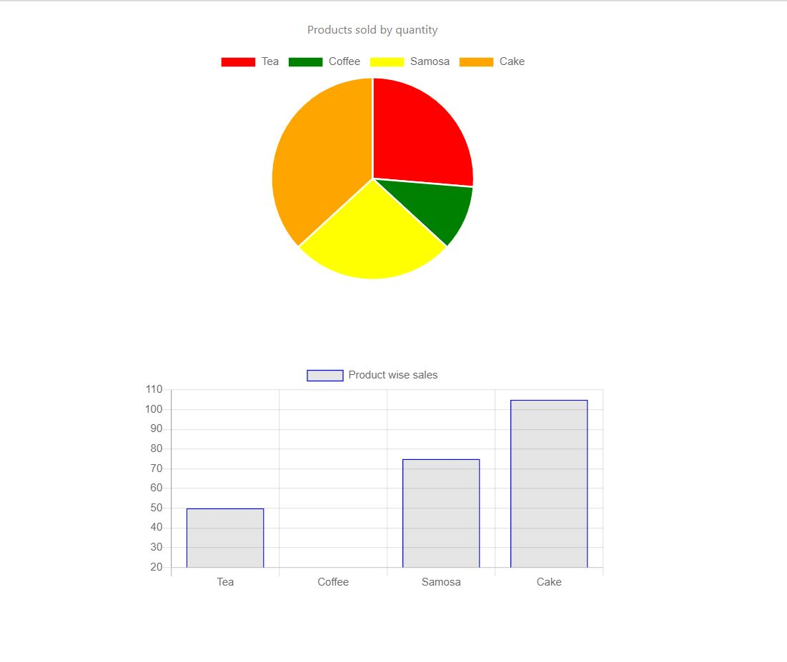

## Restaurant Management

## Technologies used
* HTML
* CSS
* JS
* Express Js
* React Js
* Node Js
* MongoDB

### Features
*  Login Page
*  Home page
*  Add Order
*  Reports(line chart,bar graph, pie chart)

### Demo

  
  ## Login
  

   
  
  ## Welcome
  
  
   
  
  ## Add Order

  
  
   
  
  
   
  
  ## Order Reports
  
   
  
   
   

