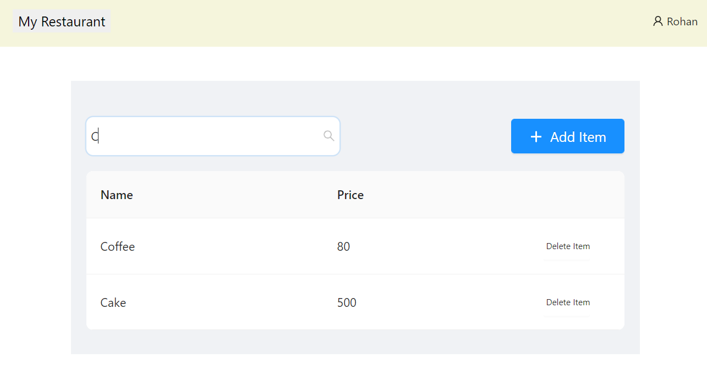
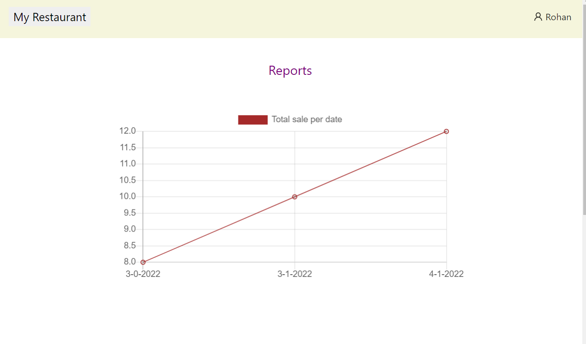

## Restaurant Management

## Technologies used
* HTML
* CSS
* JS
* Express Js
* React Js
* Node Js
* MongoDB

### Features
*  Login Page
*  Welcome page
*  Place Order
*  Reports(line chart,bar graph, pie chart)
*  Logout

#### Demo

  
  ##### Login
  

   
  
  ##### Welcome
  

   
  
  ##### Add Item
  

   
  
  ##### Items
  

   
  
  
    
  ##### Delete Item
  

   
  
      
  ##### Search Item
  

   
  
  
   
  
  ##### Add Order

  
  
   
  
  
   
  
  
   
  
  ##### Remove item from order

  
  
   
  
  
   
  
  
  ##### Order Reports
    
  
   
  
    
  
   
  
  
  
   
  
  
  
   
   

